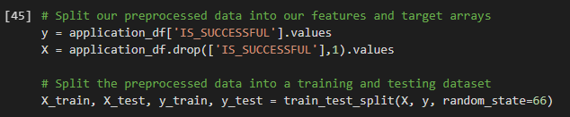
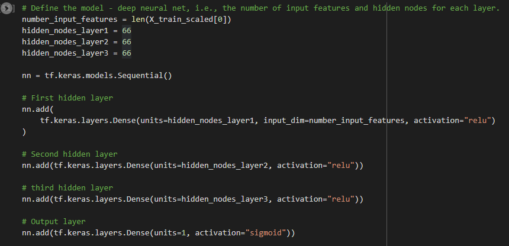

# Neural Network Charity Analysis

## Overview
This repo uses Machine learning and Neural Networks to create a binary classifier that can predict whether applicants will be successful if funded. The csv dataset contains more than 34,000 organizations that have received funding over a period of time.

The data is preprocessed using pandas and `OneHotEncoder`. After the preprocessing is complete `StandardScaler` is applied and the data is feed to the TensorFlow model.

## Results
- Data Preprocessing

    
   
   
  - The column `IS_SUCCESSFUL` is considered as the target for this deep learning model.
  - The columns `APPLICATION_TYPE, AFFILIATION, CLASSIFICATION, USE_CASE, ORGANIZATION, STATUS, INCOME_AMT, SPECIAL_CONSIDERATIONS, ASK_AMT` are the features prior to encoding, scaling and splitting. 
  - The columns `EIN` and `NAME` are neither targets nor features, thus removed from the input data.

- Compiling, Training, and Evaluating the Model
  - As seen on the second image the model has 3 hidden layers with `relu` activation, all composed of 66 neurons and last output layer with `sigmoid` as activation.
  - This model was not able to reach 75% or higher target performance, largly due to the limitations of the dataset.
  - Several steps were taken to try and increase the model’s performance, some of the steps include using `keras_tuner`, changing/optimizing the `input dimension` and lastly
adding additional `hidden layers` with different configuration of neurons.  

## Summary
In conclusion, while optimization of the model to get past the accuracy of 75% was not meet with this dataset, the deep learning model still came close with 73% accuracy after optimization. 
Since this is a binary classification problem, it would be more efficient to run a Supervised learning models like Logistic Regression and Random Forest.

## Resources 
- Data Source:
  - [charity_data.csv](https://github.com/xumed001/Neural_Network_Charity_Analysis/tree/main/Resources)
- Software/Modules:
  - Python (Google Colab)
  - tensorflow 
  - sklearn
  - pandas
